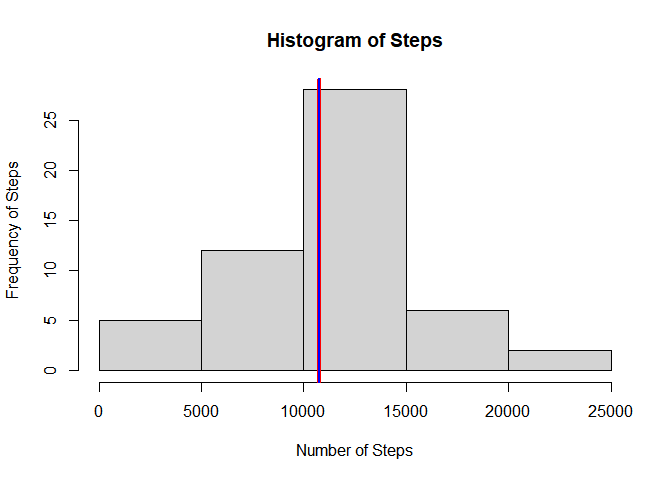
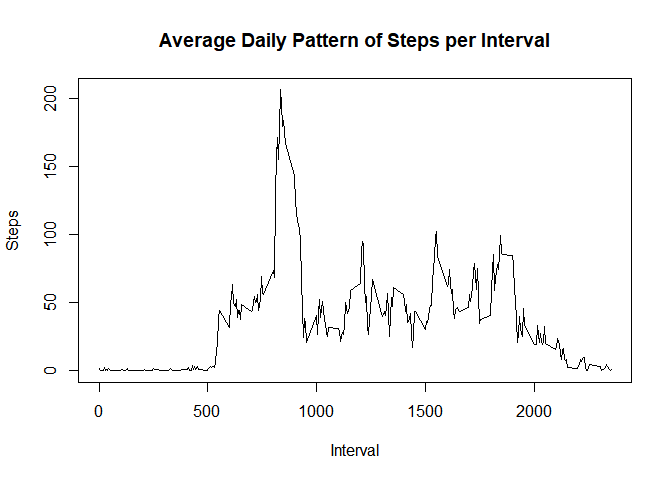
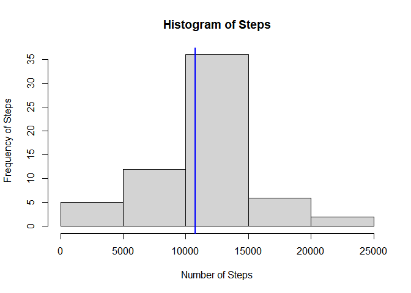
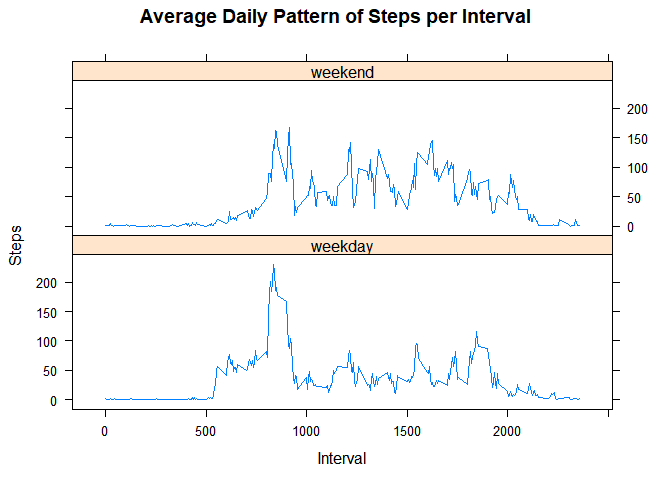

## Loading and preprocessing the data
First, we'll unzip the file from the repo and then read the file. 

```r
unzip(zipfile = "activity.zip")
activity <- read.csv("activity.csv")
str(activity)
```

```
## 'data.frame':	17568 obs. of  3 variables:
##  $ steps   : int  NA NA NA NA NA NA NA NA NA NA ...
##  $ date    : chr  "2012-10-01" "2012-10-01" "2012-10-01" "2012-10-01" ...
##  $ interval: int  0 5 10 15 20 25 30 35 40 45 ...
```

Above, we see a summary of the dataset. We'll convert the "Date" column into the date format for future use.

```r
activity$date <- as.Date(activity$date)
str(activity$date)
```

```
##  Date[1:17568], format: "2012-10-01" "2012-10-01" "2012-10-01" "2012-10-01" "2012-10-01" ...
```
Hence, we have a dataset ready for analysis.

## What is mean total number of steps taken per day?

### Mean and Median total number of steps per day

Calculate mean and median values for each day. First, find the total number of steps for each day and then use that to find the mean and median. 


```r
total_steps_day <- aggregate(steps ~ date, activity, sum)
mean_steps_day <- mean(total_steps_day$steps)
print(mean_steps_day)
```

```
## [1] 10766.19
```

```r
median_steps_day <- median(total_steps_day$steps)
print(median_steps_day)
```

```
## [1] 10765
```

### Histogram
Make a histogram for the total number of steps per day. We'll use the basic plot library to do this. We also draw a vertical line to indicate the mean and median.


```r
hist(total_steps_day$steps, xlab = "Number of Steps", ylab = "Frequency of Steps", main = "Histogram of Steps")
abline(v = mean_steps_day, col = "red", lwd = 4)
abline(v = median_steps_day, col = "blue", lwd = 2)
```

<!-- -->

It is noted that the value of the mean and median are very close so it is hard to see both in the image. I used lines of different widths to show that both are very close by. 

## What is the average daily activity pattern?
Aggregate the data based on the interval and find the mean to get the mean number of steps per interval.

```r
mean_steps_interval <- aggregate(steps ~ interval, activity, mean)
plot(mean_steps_interval$interval, mean_steps_interval$steps, type = "l", main = "Average Daily Pattern of Steps per Interval", xlab = "Interval", ylab = "Steps")
```

<!-- -->
We then find the interval with the maximum number of steps

```r
max_val <- max(mean_steps_interval[, 2])
max_activity_interval <- mean_steps_interval[mean_steps_interval[, 2] == max_val, 1]
print(max_activity_interval)
```

```
## [1] 835
```
## Imputing missing values

First, we calculate the total number of missing values in the dataset.

```r
summary(activity)
```

```
##      steps             date               interval     
##  Min.   :  0.00   Min.   :2012-10-01   Min.   :   0.0  
##  1st Qu.:  0.00   1st Qu.:2012-10-16   1st Qu.: 588.8  
##  Median :  0.00   Median :2012-10-31   Median :1177.5  
##  Mean   : 37.38   Mean   :2012-10-31   Mean   :1177.5  
##  3rd Qu.: 12.00   3rd Qu.:2012-11-15   3rd Qu.:1766.2  
##  Max.   :806.00   Max.   :2012-11-30   Max.   :2355.0  
##  NA's   :2304
```
Hence, we see that there are 2304 NAs in the dataset. All of them are in the steps column

To impute the data, just use the average value for each interval and use that.

```r
activity_impute <- read.csv("activity.csv")
activity_impute$steps[is.na(activity_impute$steps)] <- mean_steps_interval$steps
str(activity_impute)
```

```
## 'data.frame':	17568 obs. of  3 variables:
##  $ steps   : num  1.717 0.3396 0.1321 0.1509 0.0755 ...
##  $ date    : chr  "2012-10-01" "2012-10-01" "2012-10-01" "2012-10-01" ...
##  $ interval: int  0 5 10 15 20 25 30 35 40 45 ...
```

Now, find the mean and median for the imputed dataset.  

```r
print(mean_steps_day)
```

```
## [1] 10766.19
```

```r
median_steps_day <- median(total_steps_day$steps)
print(median_steps_day)
```

```
## [1] 10765
```

```r
total_steps_day <- aggregate(steps ~ date, activity_impute, sum)
mean_steps_day <- mean(total_steps_day$steps)
```
It is interesting to note that the mean and median for the dataset are now the same.

Now, plot the histogram to see how the data has changed. 

```r
hist(total_steps_day$steps, xlab = "Number of Steps", ylab = "Frequency of Steps", main = "Histogram of Steps")
abline(v = mean_steps_day, col = "red", lwd = 2)
abline(v = median_steps_day, col = "blue", lwd = 2)
```

<!-- -->


## Are there differences in activity patterns between weekdays and weekends?
Now, first find the weekdays of the given dates. 

```r
activity_impute$dayofweek <- weekdays(as.Date(activity_impute$date))
head(activity_impute)
```

```
##       steps       date interval dayofweek
## 1 1.7169811 2012-10-01        0    Monday
## 2 0.3396226 2012-10-01        5    Monday
## 3 0.1320755 2012-10-01       10    Monday
## 4 0.1509434 2012-10-01       15    Monday
## 5 0.0754717 2012-10-01       20    Monday
## 6 2.0943396 2012-10-01       25    Monday
```

Now, we change the name of the day to "weekday" or "weekend" based on the "dayofweek" value


```r
activity_impute$dayofweek[activity_impute$dayofweek == "Saturday" | activity_impute$dayofweek == "Sunday"] <- "weekend"
activity_impute$dayofweek[activity_impute$dayofweek != "weekend"] <- "weekday"
activity_impute$dayofweek <- as.factor(activity_impute$dayofweek)
head(activity_impute)
```

```
##       steps       date interval dayofweek
## 1 1.7169811 2012-10-01        0   weekday
## 2 0.3396226 2012-10-01        5   weekday
## 3 0.1320755 2012-10-01       10   weekday
## 4 0.1509434 2012-10-01       15   weekday
## 5 0.0754717 2012-10-01       20   weekday
## 6 2.0943396 2012-10-01       25   weekday
```

Next, make a panel plot that gives the of the average number of steps taken during weekdays and weekends as a time series based on the intervals. Since example in ReadMe.md used Lattice, we'll use that here as well.


```r
mean_steps_interval <- aggregate(steps ~ interval + dayofweek, activity_impute, mean)
library(lattice)
xyplot(steps ~ interval | dayofweek, data = mean_steps_interval, type = "l", layout = c(1, 2), main = "Average Daily Pattern of Steps per Interval", xlab = "Interval", ylab = "Steps")
```

<!-- -->
